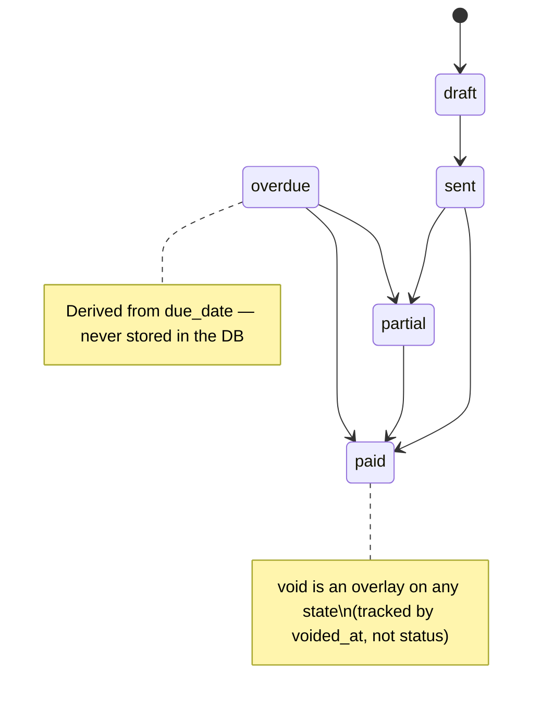

# Billing Lifecycle

**Source:** [`src/domain/billing.ts`](../../src/domain/billing.ts)

---

## States

`BillingStatus` is a plain TypeScript union — not a DB enum. The `invoices.status` column is `text` with default `'draft'`; the DB does not enforce the set of values.

| Status | Meaning |
|---|---|
| `draft` | Invoice created, not yet sent to the customer |
| `sent` | Sent — payment is expected |
| `partial` | At least one payment received, but balance remains |
| `paid` | Fully settled |
| `overdue` | **Derived** — never stored. An outstanding invoice whose `due_date` has passed |

`overdue` is computed at read time by `isOverdue(inv, todayISO)`. It is never written to the DB.

`void` is an **overlay**, not a status value. It is tracked by `invoices.voided_at` (nullable timestamp). A voided invoice can be in any `status`; all status-bearing helpers (`isOutstanding`, `countsAsRevenue`, etc.) check `isVoided` first.

---

## Transitions

The table below mirrors the `TRANSITIONS` constant in `billing.ts`. These are the **manual** transitions (staff pressing a button). Payment-driven status changes go through `nextStatusAfterPayment`.

| From | Allowed `to` |
|---|---|
| `draft` | `sent` |
| `sent` | `partial`, `paid` |
| `partial` | `paid` |
| `paid` | _(terminal — no manual exits)_ |
| `overdue` | `partial`, `paid` |

`canTransition(from, to)` returns `true` only for the pairs in this table.

---

## State diagram



---

## Derived helpers

### `isOverdue(inv, todayISO)`
```
isOutstanding(inv) && inv.due_date < todayISO
```
An invoice is overdue when it is outstanding (status `sent | partial | overdue`, not voided) **and** its `due_date` is strictly before today's ISO date string.

### `isOutstanding(inv)`
Not voided **and** `status` is one of `sent | partial | overdue`.

### `countsAsRevenue(inv)`
Not voided **and** `status === 'paid'`.

---

## "Mark Paid creates a balancing payment" rule

Currently `Mark Paid` on the invoice detail page does **two sequential writes**:

1. Insert a `payments` row for the outstanding balance.
2. Re-read the paid sum from the DB, then call `nextStatusAfterPayment(current, paidSum, total)` to compute the next status and update `invoices.status`.

`nextStatusAfterPayment(current, paidSum, total)`:
- Returns `'paid'` if `current === 'paid'` **or** `paidSum >= total`.
- Returns `'partial'` otherwise.
- An already-`paid` invoice never downgrades.

These two writes are **not atomic** (Plan 2 will introduce an RPC to make them atomic).

---

## How to change this

### Add a new billing status (e.g. `disputed`)
1. Add the literal to `BillingStatus` in `src/domain/billing.ts`.
2. Add entries to `TRANSITIONS` (which statuses it can come from, which it can go to).
3. Add it to `OUTSTANDING_STATUSES` if it should block revenue recognition.
4. Because `invoices.status` is plain text today, no DB migration is required — but Plan 2 adds a `status` enum/CHECK constraint; at that point you must also add a migration for the new value.
5. Update any display maps (labels, colors) in UI components that enumerate `BillingStatus`.

### Change the overdue rule
Edit `isOverdue` in `src/domain/billing.ts`. No DB change needed — `overdue` is never stored.

### Make the Mark-Paid write atomic
Replace the two sequential writes with a single Supabase RPC (`mark_invoice_paid`). This is tracked in Plan 2 of the replan.
