# Foundation Implementation Plan (Spec 1, Plan 1 of 4)

> **For agentic workers:** REQUIRED SUB-SKILL: Use superpowers:subagent-driven-development (recommended) or superpowers:executing-plans to implement this plan task-by-task. Steps use checkbox (`- [ ]`) syntax for tracking.

**Goal:** Stand up the server-first foundation — versioned DB baseline, `src/data` + `src/domain` layers, Tailwind v4, global feedback — and the pure billing + production state machines with full tests, leaving the app runnable.

**Architecture:** Server-first. `src/data/` becomes the only Supabase caller (added in Plan 2); `src/domain/` holds pure, unit-tested business logic (this plan); cohesion later comes from `revalidateTag`. This plan builds the infrastructure + domain core that Plans 2–4 (data layer, invoices, work status) consume.

**Tech Stack:** Next.js 16 (App Router), React 19, Supabase (`@supabase/ssr`), Tailwind v4, Vitest, Zod.

## Global Constraints

- No React component calls `supabase.from(...)` directly — all DB access lives in `src/data/` (enforced from Plan 2).
- Reads via Server Components; writes via Server Actions; cross-view cohesion via `revalidateTag`.
- `src/domain/` is pure and unit-tested; pages/components hold no business logic.
- **Security is deferred (Spec 5):** RLS stays permissive; do NOT add `requirePermission` to new code yet, but keep the single-choke-point structure so it lands in one place later.
- Zod schemas live in `src/domain/` and are shared by client forms and server actions.
- DB changes are additive / forward-compatible only.
- Every new directory ships a `README.md`; module docs live in `docs/modules/` and are indexed by `docs/ARCHITECTURE.md`.
- New code is written `strict`-clean TypeScript even though global `strict` stays off until the old modules are migrated (deviation from spec §4.4, see Task 0 note).

---

## Task 0 (note): TypeScript strict sequencing

The spec lists enabling global `strict` in the foundation phase. Flipping it now would surface errors across Customers/Products/old-Invoices code we are about to delete in Plans 2–4 — wasted churn. **Decision:** keep `strict: false` globally for now; write all `src/domain` and `src/data` code strict-clean; flip global `strict` in the final migration plan once old modules are gone. No task here; recorded so the deviation is intentional.

---

## File structure (created in this plan)

```
supabase/migrations/<ts>_baseline_schema.sql   # captured current DB schema (Task 1)
src/domain/
  README.md            # what domain/ is and the rules for it
  billing.ts           # billing state machine (Task 5)
  billing.test.ts
  production.ts        # production state machine + on_hold resume (Task 6)
  production.test.ts
  money.ts             # currency + reconciliation helpers (Task 7)
  money.test.ts
  aggregation.ts       # derived invoice production status (Task 8)
  aggregation.test.ts
  schemas.ts           # shared Zod schemas (Task 9)
  schemas.test.ts
  permissions.ts       # ported permission catalogue + checks (Task 10)
  permissions.test.ts
  index.ts             # barrel
src/data/
  README.md            # the only Supabase caller; filled in Plan 2
src/components/feedback/
  toast.tsx            # toast provider + hook (Task 4)
  error-boundary.tsx   # global error boundary (Task 4)
src/lib/action-result.ts  # standard server-action result shape (Task 4)
docs/modules/
  data-model.md, billing-lifecycle.md, work-status.md, permissions.md  (Task 11)
```

Tailwind v4 touches: `package.json`, `postcss.config.mjs`, `src/app/globals.css`, remove/retire `tailwind.config.js` (Task 3).

---

## Task 1: Version the live DB schema (baseline migration)

**Why:** the repo has only the RLS migration; the table/function/trigger/policy DDL exists only on the remote DB. Capture it so the schema is reproducible and changes are reviewable.

**Files:**
- Create: `supabase/config.toml` (via `supabase init`)
- Create: `supabase/migrations/<timestamp>_baseline_schema.sql`

**Prerequisite (needs user):** a DB connection is required to dump the schema. Obtain the project's **database password** (Supabase dashboard → Project Settings → Database) or a direct connection string. If unavailable, ask the user before starting this task.

- [ ] **Step 1: Initialize the Supabase project locally**

Run: `supabase init` (accept defaults; creates `supabase/config.toml`)
Expected: `Finished supabase init.`

- [ ] **Step 2: Link to the remote project**

Run: `supabase link --project-ref <PROJECT_REF>` (enter DB password when prompted)
Expected: `Finished supabase link.`

- [ ] **Step 3: Pull the current remote schema into a baseline migration**

Run: `supabase db pull baseline_schema`
Expected: a new `supabase/migrations/<ts>_baseline_schema.sql` containing tables, the `work_status` enum, functions, triggers, and policies.

- [ ] **Step 4: Verify the migration history reconciles**

Run: `supabase migration list`
Expected: local and remote lists match (the baseline + the RLS migration both present, no divergence).

- [ ] **Step 5: Commit**

```bash
git add supabase/config.toml supabase/migrations/
git commit -m "chore(db): capture baseline schema into versioned migrations"
```

> Fallback if no DB password is available: extract definitions via the Supabase MCP — `select pg_get_functiondef(oid) ...` for each function, `pg_get_triggerdef(oid)` for triggers, and `pg_policies` for policies — and hand-author the baseline migration. Prefer the `db pull` path.

---

## Task 2: Scaffold the domain and data layers

**Files:**
- Create: `src/domain/README.md`, `src/domain/index.ts`
- Create: `src/data/README.md`

- [ ] **Step 1: Write `src/domain/README.md`**

```markdown
# domain/

Pure, framework-free business rules. No React, no Supabase, no I/O.
Everything here is synchronous, deterministic, and unit-tested.

- `billing.ts` — invoice billing state machine (draft→sent→partial→paid, void, overdue)
- `production.ts` — per-item production state machine (received→in_progress→ready→delivered, on_hold)
- `money.ts` — currency formatting + payment reconciliation
- `aggregation.ts` — derive an invoice's production status from its items
- `schemas.ts` — Zod schemas shared by client forms and server actions
- `permissions.ts` — permission catalogue + checks

Rule: if it needs the network, the DB, or the request, it does NOT belong here.
```

- [ ] **Step 2: Write `src/data/README.md`**

```markdown
# data/

The ONLY place that talks to Supabase. One module per aggregate.
Reads are server-side query functions (called from Server Components).
Writes are Server Actions ('use server') and call `revalidateTag(...)`.
Filled in during Plan 2. Components must never import `@/lib/supabase` directly.
```

- [ ] **Step 3: Create the barrel `src/domain/index.ts`**

```ts
export * from './billing'
export * from './production'
export * from './money'
export * from './aggregation'
export * from './schemas'
export * from './permissions'
```

- [ ] **Step 4: Verify it builds**

Run: `npx tsc --noEmit`
Expected: exit 0 (empty modules referenced by the barrel resolve once Tasks 5–10 land; if running before them, comment unfinished exports — re-enable per task).

- [ ] **Step 5: Commit**

```bash
git add src/domain src/data
git commit -m "chore: scaffold domain and data layers with READMEs"
```

---

## Task 3: Migrate to Tailwind v4

**Files:**
- Modify: `package.json` (deps + scripts), `postcss.config.mjs`, `src/app/globals.css`
- Remove: `tailwind.config.js` (tokens move into CSS `@theme`)

- [ ] **Step 1: Install v4 packages**

Run: `npm install tailwindcss@4 @tailwindcss/postcss@4 && npm uninstall autoprefixer`
Expected: `tailwindcss@^4` in `package.json`.

- [ ] **Step 2: Update `postcss.config.mjs`**

```js
const config = {
  plugins: { '@tailwindcss/postcss': {} },
}
export default config
```

- [ ] **Step 3: Convert `src/app/globals.css` to the v4 import + `@theme`**

Replace the v3 `@tailwind base/components/utilities` directives with:

```css
@import "tailwindcss";

@theme {
  /* migrate the existing tailwind.config.js theme tokens here, e.g.: */
  --color-border: hsl(214.3 31.8% 91.4%);
  --color-background: hsl(0 0% 100%);
  --color-foreground: hsl(222.2 84% 4.9%);
  /* ...port the rest of the shadcn token set from tailwind.config.js... */
}
```

- [ ] **Step 4: Delete the old config**

Run: `git rm tailwind.config.js`

- [ ] **Step 5: Verify build + visual smoke**

Run: `npm run build`
Expected: build succeeds. Then `npm run dev`, log in as `admin`, confirm the dashboard and an invoice page render with intact styling.

- [ ] **Step 6: Commit**

```bash
git add -A
git commit -m "chore: migrate Tailwind v3 -> v4 (CSS-first @theme config)"
```

---

## Task 4: Global feedback primitives

**Files:**
- Create: `src/lib/action-result.ts`, `src/components/feedback/toast.tsx`, `src/components/feedback/error-boundary.tsx`
- Modify: `src/app/(authenticated)/layout.tsx` (mount providers)

**Interfaces:**
- Produces: `type ActionResult<T> = { ok: true; data: T } | { ok: false; error: string }`; `ok(data)`, `fail(error)` helpers; `<ToastProvider>` + `useToast()`; `<ErrorBoundary>`.

- [ ] **Step 1: Write the failing test for `action-result`**

```ts
// src/lib/action-result.test.ts
import { describe, it, expect } from 'vitest'
import { ok, fail } from './action-result'
describe('action-result', () => {
  it('wraps success', () => expect(ok(42)).toEqual({ ok: true, data: 42 }))
  it('wraps failure', () => expect(fail('nope')).toEqual({ ok: false, error: 'nope' }))
})
```

- [ ] **Step 2: Run it, verify it fails**

Run: `npx vitest run src/lib/action-result.test.ts`
Expected: FAIL (module not found).

- [ ] **Step 3: Implement `src/lib/action-result.ts`**

```ts
export type ActionResult<T = void> =
  | { ok: true; data: T }
  | { ok: false; error: string }

export const ok = <T>(data: T): ActionResult<T> => ({ ok: true, data })
export const fail = (error: string): ActionResult<never> => ({ ok: false, error })
```

- [ ] **Step 4: Run it, verify it passes**

Run: `npx vitest run src/lib/action-result.test.ts`
Expected: PASS.

- [ ] **Step 5: Implement the toast provider + error boundary**

Create `src/components/feedback/toast.tsx` (a `'use client'` context exposing `useToast().show({title, variant})`, rendering a fixed stack) and `src/components/feedback/error-boundary.tsx` (a `'use client'` class component with `componentDidCatch` rendering a fallback + reset). Mount both in `src/app/(authenticated)/layout.tsx` wrapping `<AppShell>`.

- [ ] **Step 6: Verify build + manual smoke**

Run: `npm run build` (exit 0). Then `npm run dev`, trigger a toast from any temporary button to confirm it shows.

- [ ] **Step 7: Commit**

```bash
git add src/lib/action-result.ts src/lib/action-result.test.ts src/components/feedback "src/app/(authenticated)/layout.tsx"
git commit -m "feat: global toast, error boundary, and ActionResult type"
```

---

## Task 5: Billing state machine (`domain/billing.ts`)

**Files:** Create `src/domain/billing.ts`, `src/domain/billing.test.ts`. (Supersedes `src/lib/invoice-status.ts`, which is deleted in Plan 3 when consumers move over.)

**Interfaces:**
- Produces: `type BillingStatus = 'draft'|'sent'|'partial'|'paid'|'overdue'`; `OUTSTANDING_STATUSES`; `isVoided(inv)`, `countsAsRevenue(inv)`, `isOutstanding(inv)`, `isOverdue(inv, todayISO)`, `canTransition(from,to)`, `nextStatusAfterPayment(current, paidSum, total)`.

- [ ] **Step 1: Write the failing tests**

```ts
// src/domain/billing.test.ts
import { describe, it, expect } from 'vitest'
import { isOverdue, nextStatusAfterPayment, canTransition, countsAsRevenue } from './billing'

const inv = (o: Partial<any> = {}) => ({ status: 'sent', due_date: '2026-01-01', voided_at: null, ...o })

describe('billing', () => {
  it('paid invoice never downgrades on payment', () =>
    expect(nextStatusAfterPayment('paid', 0, 100)).toBe('paid'))
  it('full payment -> paid', () =>
    expect(nextStatusAfterPayment('sent', 100, 100)).toBe('paid'))
  it('partial payment -> partial', () =>
    expect(nextStatusAfterPayment('sent', 40, 100)).toBe('partial'))
  it('overdue is derived from due_date', () => {
    expect(isOverdue(inv({ status: 'sent', due_date: '2026-01-01' }), '2026-06-18')).toBe(true)
    expect(isOverdue(inv({ status: 'paid', due_date: '2026-01-01' }), '2026-06-18')).toBe(false)
    expect(isOverdue(inv({ voided_at: '2026-02-02' }), '2026-06-18')).toBe(false)
  })
  it('voided never counts as revenue', () =>
    expect(countsAsRevenue(inv({ status: 'paid', voided_at: '2026-02-02' }))).toBe(false))
  it('allows draft->sent, forbids paid->draft', () => {
    expect(canTransition('draft', 'sent')).toBe(true)
    expect(canTransition('paid', 'draft')).toBe(false)
  })
})
```

- [ ] **Step 2: Run, verify fail**

Run: `npx vitest run src/domain/billing.test.ts` → FAIL (module not found).

- [ ] **Step 3: Implement `src/domain/billing.ts`**

```ts
export type BillingStatus = 'draft' | 'sent' | 'partial' | 'paid' | 'overdue'

export const OUTSTANDING_STATUSES: BillingStatus[] = ['sent', 'partial', 'overdue']

type InvoiceLike = { status: string; due_date: string; voided_at: string | null }

export const isVoided = (inv: Pick<InvoiceLike, 'voided_at'>) => inv.voided_at != null
export const isOutstanding = (inv: InvoiceLike) =>
  !isVoided(inv) && OUTSTANDING_STATUSES.includes(inv.status as BillingStatus)
export const countsAsRevenue = (inv: InvoiceLike) => !isVoided(inv) && inv.status === 'paid'
export const isOverdue = (inv: InvoiceLike, todayISO: string) =>
  isOutstanding(inv) && inv.due_date < todayISO

// allowed MANUAL transitions (payment-driven changes go through nextStatusAfterPayment)
const TRANSITIONS: Record<BillingStatus, BillingStatus[]> = {
  draft: ['sent'],
  sent: ['partial', 'paid'],
  partial: ['paid'],
  paid: [],
  overdue: ['partial', 'paid'],
}
export const canTransition = (from: BillingStatus, to: BillingStatus) =>
  TRANSITIONS[from]?.includes(to) ?? false

export const nextStatusAfterPayment = (
  current: BillingStatus,
  paidSum: number,
  total: number,
): BillingStatus => (current === 'paid' || paidSum >= total ? 'paid' : 'partial')
```

- [ ] **Step 4: Run, verify pass**

Run: `npx vitest run src/domain/billing.test.ts` → PASS.

- [ ] **Step 5: Commit**

```bash
git add src/domain/billing.ts src/domain/billing.test.ts
git commit -m "feat(domain): billing state machine"
```

---

## Task 6: Production state machine + on_hold resume (`domain/production.ts`)

**Files:** Create `src/domain/production.ts`, `src/domain/production.test.ts`. (Ports `src/lib/work-status.ts` + `src/lib/work-stages.ts`; old files deleted in Plan 4.)

**Interfaces:**
- Produces: `type WorkStatus = 'received'|'in_progress'|'ready'|'delivered'|'on_hold'`; `LINEAR_FLOW`; `nextWorkStatus(s)`; `hold(current)`, `resume(resumeFrom)`; `encodeWork(status, stageId)`, `decodeWork(value)`; `workOptions(stages)`.
- `hold`/`resume` model the on_hold round trip: `hold` returns `'on_hold'` and the caller persists the prior status (the `resume_status` column added in Plan 2); `resume(resumeFrom)` returns where to go back to.

- [ ] **Step 1: Write the failing tests**

```ts
// src/domain/production.test.ts
import { describe, it, expect } from 'vitest'
import { nextWorkStatus, hold, resume, encodeWork, decodeWork } from './production'

describe('production', () => {
  it('advances along the linear flow', () => {
    expect(nextWorkStatus('received')).toBe('in_progress')
    expect(nextWorkStatus('ready')).toBe('delivered')
    expect(nextWorkStatus('delivered')).toBe(null)
  })
  it('on_hold has no linear next', () => expect(nextWorkStatus('on_hold')).toBe(null))
  it('hold remembers prior status; resume returns to it', () => {
    expect(hold('in_progress')).toEqual({ status: 'on_hold', resumeFrom: 'in_progress' })
    expect(resume('in_progress')).toBe('in_progress')
    expect(resume(null)).toBe('received') // safe default
  })
  it('encodes/decodes a stage pairing', () => {
    expect(encodeWork('in_progress', 'abc')).toBe('stage:abc')
    expect(decodeWork('stage:abc')).toEqual({ status: 'in_progress', stageId: 'abc' })
    expect(decodeWork('ready')).toEqual({ status: 'ready', stageId: null })
  })
})
```

- [ ] **Step 2: Run, verify fail**

Run: `npx vitest run src/domain/production.test.ts` → FAIL.

- [ ] **Step 3: Implement `src/domain/production.ts`**

```ts
export type WorkStatus = 'received' | 'in_progress' | 'ready' | 'delivered' | 'on_hold'
export const LINEAR_FLOW: WorkStatus[] = ['received', 'in_progress', 'ready', 'delivered']

export const nextWorkStatus = (s: WorkStatus): WorkStatus | null => {
  const i = LINEAR_FLOW.indexOf(s)
  return i >= 0 && i < LINEAR_FLOW.length - 1 ? LINEAR_FLOW[i + 1] : null
}

export const hold = (current: WorkStatus) =>
  ({ status: 'on_hold' as const, resumeFrom: current })
export const resume = (resumeFrom: WorkStatus | null): WorkStatus => resumeFrom ?? 'received'

export type WorkValue = `stage:${string}` | WorkStatus
export const encodeWork = (status: WorkStatus, stageId: string | null): WorkValue =>
  status === 'in_progress' && stageId ? (`stage:${stageId}` as const) : status
export const decodeWork = (value: string): { status: WorkStatus; stageId: string | null } =>
  value.startsWith('stage:')
    ? { status: 'in_progress', stageId: value.slice(6) }
    : { status: value as WorkStatus, stageId: null }

// Port `workOptions`, `workOptionsForItem`, `orderedGroupKeys` from src/lib/work-stages.ts
// verbatim (they are already correct); add their existing tests to this file.
```

- [ ] **Step 4: Run, verify pass**

Run: `npx vitest run src/domain/production.test.ts` → PASS.

- [ ] **Step 5: Port the work-stages option/grouping helpers + their tests**

Copy `workOptions`, `workOptionsForItem`, `orderedGroupKeys` and the existing assertions from `src/lib/work-stages.test.ts` into `production.ts` / `production.test.ts`. Run `npx vitest run src/domain/production.test.ts` → PASS.

- [ ] **Step 6: Commit**

```bash
git add src/domain/production.ts src/domain/production.test.ts
git commit -m "feat(domain): production state machine with on_hold resume"
```

---

## Task 7: Money helpers (`domain/money.ts`)

**Files:** Create `src/domain/money.ts`, `src/domain/money.test.ts`.

**Interfaces:**
- Produces: `formatCurrency(n)`, `outstandingAmount(total, paidSum)`, `balancingPaymentAmount(total, paidSum)` (used by Mark-Paid to create the reconciling payment row in Plan 2/3).

- [ ] **Step 1: Write the failing tests**

```ts
// src/domain/money.test.ts
import { describe, it, expect } from 'vitest'
import { outstandingAmount, balancingPaymentAmount, formatCurrency } from './money'
describe('money', () => {
  it('outstanding clamps at 0', () => {
    expect(outstandingAmount(100, 40)).toBe(60)
    expect(outstandingAmount(100, 120)).toBe(0)
  })
  it('balancing payment equals outstanding', () =>
    expect(balancingPaymentAmount(100, 40)).toBe(60))
  it('formats MYR', () => expect(formatCurrency(1234.5)).toContain('1,234.50'))
})
```

- [ ] **Step 2: Run, verify fail** — `npx vitest run src/domain/money.test.ts` → FAIL.

- [ ] **Step 3: Implement `src/domain/money.ts`**

```ts
export const formatCurrency = (n: number) =>
  new Intl.NumberFormat('ms-MY', { style: 'currency', currency: 'MYR' }).format(n)

export const outstandingAmount = (total: number, paidSum: number) =>
  Math.max(0, Number((total - paidSum).toFixed(2)))

export const balancingPaymentAmount = (total: number, paidSum: number) =>
  outstandingAmount(total, paidSum)
```

- [ ] **Step 4: Run, verify pass** — `npx vitest run src/domain/money.test.ts` → PASS.

- [ ] **Step 5: Commit**

```bash
git add src/domain/money.ts src/domain/money.test.ts
git commit -m "feat(domain): money + reconciliation helpers"
```

---

## Task 8: Production aggregation (`domain/aggregation.ts`)

**Files:** Create `src/domain/aggregation.ts`, `src/domain/aggregation.test.ts`.

**Interfaces:**
- Consumes: `WorkStatus` from `./production`.
- Produces: `dominantProductionStatus(items)`, `summarizeProduction(items)` — the single rule for an invoice's derived production status used everywhere.

- [ ] **Step 1: Write the failing tests**

```ts
// src/domain/aggregation.test.ts
import { describe, it, expect } from 'vitest'
import { dominantProductionStatus } from './aggregation'
describe('aggregation', () => {
  it('attention-first: on_hold dominates', () =>
    expect(dominantProductionStatus([{ work_status: 'delivered' }, { work_status: 'on_hold' }])).toBe('on_hold'))
  it('least-progressed wins among active', () =>
    expect(dominantProductionStatus([{ work_status: 'ready' }, { work_status: 'received' }])).toBe('received'))
  it('empty -> received', () => expect(dominantProductionStatus([])).toBe('received'))
})
```

- [ ] **Step 2: Run, verify fail** — `npx vitest run src/domain/aggregation.test.ts` → FAIL.

- [ ] **Step 3: Implement `src/domain/aggregation.ts`**

```ts
import type { WorkStatus } from './production'

const DOMINANT_PRIORITY: WorkStatus[] = ['on_hold', 'received', 'in_progress', 'ready', 'delivered']

export const dominantProductionStatus = (items: { work_status: WorkStatus | string }[]): WorkStatus => {
  if (items.length === 0) return 'received'
  for (const status of DOMINANT_PRIORITY) {
    if (items.some((i) => i.work_status === status)) return status
  }
  return 'received'
}

export const summarizeProduction = (items: { work_status: WorkStatus | string }[]) =>
  DOMINANT_PRIORITY.reduce<Record<string, number>>((acc, s) => {
    acc[s] = items.filter((i) => i.work_status === s).length
    return acc
  }, {})
```

- [ ] **Step 4: Run, verify pass** — `npx vitest run src/domain/aggregation.test.ts` → PASS.

- [ ] **Step 5: Commit**

```bash
git add src/domain/aggregation.ts src/domain/aggregation.test.ts
git commit -m "feat(domain): invoice production-status aggregation"
```

---

## Task 9: Shared Zod schemas (`domain/schemas.ts`)

**Files:** Create `src/domain/schemas.ts`, `src/domain/schemas.test.ts`.

**Interfaces:**
- Produces: `lineItemSchema`, `invoiceInputSchema`, `paymentInputSchema`, `customerInputSchema`, `productInputSchema` + inferred types (`InvoiceInput`, etc.). Consumed by client forms AND server actions (Plans 2–4).

- [ ] **Step 1: Write the failing tests**

```ts
// src/domain/schemas.test.ts
import { describe, it, expect } from 'vitest'
import { paymentInputSchema, invoiceInputSchema } from './schemas'
describe('schemas', () => {
  it('rejects non-positive payment', () =>
    expect(paymentInputSchema.safeParse({ amount: 0 }).success).toBe(false))
  it('requires at least one line item', () =>
    expect(invoiceInputSchema.safeParse({ customer_id: 'x', due_date: '2026-01-01', items: [] }).success).toBe(false))
})
```

- [ ] **Step 2: Run, verify fail** — `npx vitest run src/domain/schemas.test.ts` → FAIL.

- [ ] **Step 3: Implement `src/domain/schemas.ts`**

```ts
import { z } from 'zod'

export const lineItemSchema = z.object({
  product_id: z.string().uuid().nullable(),
  description: z.string().min(1),
  quantity: z.number().positive(),
  unit_price: z.number().min(0),
})
export const invoiceInputSchema = z.object({
  customer_id: z.string().uuid(),
  due_date: z.string().regex(/^\d{4}-\d{2}-\d{2}$/),
  patient: z.string().optional(),
  doctor: z.string().optional(),
  items: z.array(lineItemSchema).min(1),
})
export const paymentInputSchema = z.object({
  amount: z.number().positive(),
  payment_date: z.string().regex(/^\d{4}-\d{2}-\d{2}$/).optional(),
  reference_number: z.string().optional(),
  notes: z.string().optional(),
})
export const customerInputSchema = z.object({
  clinic_name: z.string().min(1),
  contact_person: z.string().optional(),
  phone: z.string().optional(),
  email: z.string().email().optional().or(z.literal('')),
})
export const productInputSchema = z
  .object({
    name: z.string().min(1),
    unit_price: z.number().min(0),
    min_unit_price: z.number().min(0).nullable(),
    max_unit_price: z.number().min(0).nullable(),
  })
  .refine((p) => p.min_unit_price == null || p.max_unit_price == null || p.min_unit_price <= p.max_unit_price, {
    message: 'min must be <= max',
  })

export type InvoiceInput = z.infer<typeof invoiceInputSchema>
export type PaymentInput = z.infer<typeof paymentInputSchema>
```

- [ ] **Step 4: Run, verify pass** — `npx vitest run src/domain/schemas.test.ts` → PASS.

- [ ] **Step 5: Commit**

```bash
git add src/domain/schemas.ts src/domain/schemas.test.ts
git commit -m "feat(domain): shared Zod schemas"
```

---

## Task 10: Port permissions (`domain/permissions.ts`)

**Files:** Create `src/domain/permissions.ts`, `src/domain/permissions.test.ts` by moving `src/lib/permissions.ts` + its test verbatim, then re-pointing imports later.

**Interfaces:**
- Produces: `PERMISSIONS`, `PERMISSION_GROUPS`, `type Permission`, `permissionGranted(role, p)`, `wouldRemoveLastSuperadmin(...)`.

- [ ] **Step 1: Move the file and its test**

Run: `git mv src/lib/permissions.ts src/domain/permissions.ts && git mv src/lib/permissions.test.ts src/domain/permissions.test.ts`

- [ ] **Step 2: Run the moved tests**

Run: `npx vitest run src/domain/permissions.test.ts`
Expected: PASS (12-permission catalogue assertion + grant/lockout tests).

- [ ] **Step 3: Re-point existing importers**

Update imports of `@/lib/permissions` to `@/domain/permissions` across the app (grep first: `grep -rn "lib/permissions" src`). Run `npx tsc --noEmit` → exit 0.

- [ ] **Step 4: Commit**

```bash
git add -A
git commit -m "refactor(domain): move permissions into domain layer"
```

---

## Task 11: Module documentation

**Files:** Create `docs/modules/data-model.md`, `billing-lifecycle.md`, `work-status.md`, `permissions.md`; update `docs/ARCHITECTURE.md` index.

- [ ] **Step 1: Write `docs/modules/billing-lifecycle.md`**

Document the `BillingStatus` states, the `TRANSITIONS` table from `domain/billing.ts`, the derived `overdue` rule, `void` as overlay, and the Mark-Paid-creates-payment rule. Include a Mermaid state diagram:

````markdown

```mermaid
stateDiagram-v2
  [*] --> draft
  draft --> sent
  sent --> partial
  sent --> paid
  partial --> paid
  overdue --> paid
  note right of paid: void is an overlay on any state; overdue is derived from due_date
```

````

- [ ] **Step 2: Write `docs/modules/work-status.md`**

Document the `WorkStatus` enum, `LINEAR_FLOW`, the stage subdivision + `encode/decode`, and the on_hold resume round trip. Include a Mermaid diagram of `received→in_progress(stage)→ready→delivered` with `on_hold` as a side state that resumes to its prior status.

- [ ] **Step 3: Write `docs/modules/data-model.md`**

Move the table reference + ERD from `docs/ARCHITECTURE.md` §3 here, expanded, as the canonical data-model doc.

- [ ] **Step 4: Write `docs/modules/permissions.md`**

Document the 12 permission keys, `is_system` semantics, `permissionGranted`, and the (deferred) server-action enforcement plan.

- [ ] **Step 5: Update `docs/ARCHITECTURE.md` to link the module docs**

Add a "Module docs" section linking the four files.

- [ ] **Step 6: Commit**

```bash
git add docs
git commit -m "docs: module references for billing, work status, data model, permissions"
```

---

## Self-review notes
- Spec coverage: foundation scaffolding (§4.1), server-first prep (§4.2 — actual data layer is Plan 2), domain state machines (§5.1, §6.1), money model helper (§5.2 — wiring in Plan 3), aggregation/link helper (§6.2 — wiring in Plan 4), Zod (§4.3), feedback (§4.4), Tailwind v4 (§4.4), schema versioning (§4.4), docs (§9). Strict TS deviation documented (Task 0).
- Deferred to later plans (intentional, not gaps): `src/data` query fns + server actions + `revalidateTag` (Plan 2), DB status enum + payment RPCs + `resume_status` column (Plan 2), invoice UI rebuild (Plan 3), work-queue UI + linkage wiring (Plan 4).

## Next plans (to be written after this one executes)
- **Plan 2 — Data layer + DB changes:** `status` enum migration, payment-on-mark-paid + atomic payment/status RPCs, `resume_status` column; `src/data/{invoices,work,payments}` query fns + server actions with `revalidateTag`.
- **Plan 3 — Invoices module** rebuilt server-first (list, decomposed detail, form via actions).
- **Plan 4 — Work-status module** (queue with `useOptimistic`, derived production status, invoice↔work linkage) + the 3 E2E flows.
